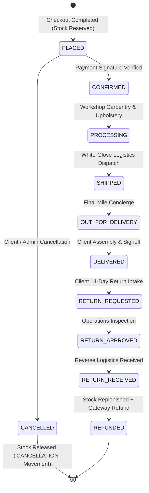

# 🏛️ Veloura Living — Deep Technical Architecture & Systems Engineering Manual

**Document Version:** 2.0  
**Target Platform:** Next.js 16 (App Router) + React 19 + TypeScript + Tailwind CSS v4 + Three.js + GSAP 3 + Lenis + Google Gemini AI  
**Dual-Engine Topology:** Frontend & Edge REST APIs (`http://localhost:3000`) + Standalone Node.js Backend Microservice (`http://localhost:5000`)  
**Workspace:** `d:\Veloura Living`  
**GitHub Repository:** [https://github.com/srushti-bore/Veloura_Living](https://github.com/srushti-bore/Veloura_Living)  

---

## 📑 Table of Contents
1. [Core Architectural Philosophy & Design Tokens](#1-core-architectural-philosophy--design-tokens)
2. [Dual-Engine Topology & Boundary Isolation](#2-dual-engine-topology--boundary-isolation)
3. [Authoritative Pricing, Taxation & Ledger Engines](#3-authoritative-pricing-taxation--ledger-engines)
4. [Inventory Concurrency & State Machine Lifecycle](#4-inventory-concurrency--state-machine-lifecycle)
5. [Spatial UI Choreography & Motion Engineering](#5-spatial-ui-choreography--motion-engineering)
6. [Tactile Material Laboratory 8K Macro Pipeline](#6-tactile-material-laboratory-8k-macro-pipeline)
7. [Cryptographic Security, Session Guards & RBAC Enclave](#7-cryptographic-security-session-guards--rbac-enclave)
8. [Automated Verification & E2E Validation Matrix](#8-automated-verification--e2e-validation-matrix)

---

## 1. Core Architectural Philosophy & Design Tokens

Veloura Living represents a "Quiet Luxury" architectural standard. Every UI component avoids loud visual saturation in favor of high-tactility materials, organic typography, smooth inertial momentum scrolling, and mathematically consistent color tokens.

### 🎨 Master Color Tokens

| Token Name | Hex Code | HSL Representation | Semantic Usage |
|---|---|---|---|
| **Veloura Espresso** | `#2A1A12` | `hsl(21, 38%, 12%)` | Primary headers, high-contrast dark accents |
| **Deep Walnut** | `#4A2C1A` | `hsl(23, 48%, 20%)` | Primary brand accent, button fills, active tabs |
| **Warm Walnut** | `#765236` | `hsl(26, 37%, 34%)` | Secondary interactive elements, icons |
| **Caramel Gold** | `#A9794F` | `hsl(28, 36%, 49%)` | Badges, spotlight ribbons, rating stars |
| **Soft Sand** | `#D8B486` | `hsl(34, 52%, 69%)` | Subtle borders, hover highlights |
| **Warm Cream** | `#F4E8D7` | `hsl(36, 56%, 90%)` | Card backgrounds, pill tags, pill highlights |
| **Ivory Canvas** | `#FAF7F2` | `hsl(38, 45%, 96%)` | Global page background canvas |
| **Taupe Gray** | `#B9AA99` | `hsl(32, 18%, 66%)` | Secondary body text, captions |
| **Charcoal Dark** | `#211915` | `hsl(20, 22%, 11%)` | Modal backdrops, 3D studio viewports |

### 🖋️ Typography Engineering
- **Display / Editorial Headings:** `Cormorant Garamond` (Google Font via `next/font/google`), loaded with `display: 'swap'` and zero Cumulative Layout Shift (CLS).
- **Interface / Body / Numerical Pricing:** `DM Sans` (Google Font), tuned for high legibility on high-DPI displays.
- **Statutory Currency Standard:** Indian Rupee (`₹`) formatted with `Intl.NumberFormat('en-IN')` ensuring localized grouping (`₹1,85,000`).

---

## 2. Dual-Engine Topology & Boundary Isolation

The architecture maintains strict decoupling between the fullstack Next.js Edge frontend and the containerized Node.js backend microservice:

```mermaid
graph TD
    ClientBrowser[Modern Web Client / Mobile / Desktop]
    
    subgraph FrontendApp [Next.js 16 App Router - Port 3000]
        NextApp[Server & Client Components / React 19]
        NextEdgeAPI[48 Edge REST API Routes /api/*]
        SwaggerDocs[/docs - Interactive Swagger UI]
        AISpatialEngine[Gemini AI Spatial Consultant]
    end
    
    subgraph StandaloneBackend [Node.js Microservice - Port 5000]
        NodeServer[Native HTTP REST Server - src/server.ts]
        AuthStore[PBKDF2 Auth & Session Engine]
        CatalogStore[Master Catalog & Inventory Store]
        OrderStore[Order & Ledger State Machine]
        PricingStore[Authoritative Tax & Coupon Engine]
        Invoicing[GST Tax Invoice Generator]
    end
    
    subgraph Persistence [PostgreSQL / Supabase Database]
        Schema[(26+ Normalized Relational Tables)]
    end
    
    ClientBrowser -->|HTTP 200 / SSR / Turbopack| NextApp
    ClientBrowser -->|Fetch /api/*| NextEdgeAPI
    ClientBrowser -->|Direct REST / Docker / Render| NodeServer
    NextEdgeAPI --> Schema
    NodeServer --> Schema
```

---

## 3. Authoritative Pricing, Taxation & Ledger Engines

To completely prevent client-side price tampering, all cart recalculations, coupon validations, shipping tiers, and tax lines are computed on the server.

### 🧮 Mathematical Recalculation Model

$$\text{Subtotal} = \sum_{i=1}^{n} (\text{Unit Price}_i \times \text{Quantity}_i)$$

$$\text{Discount} = \min\left( \text{Subtotal} \times \text{Coupon Discount Rate}, \text{Coupon Max Cap} \right)$$

$$\text{Taxable Amount} = \max(0, \text{Subtotal} - \text{Discount})$$

$$\text{GST Amount (18\%)} = \text{Taxable Amount} \times 0.18$$

$$\text{Shipping Fee} = \begin{cases} 
0 & \text{if } \text{Taxable Amount} \ge ₹1,00,000 \\ 
₹4,500 & \text{if } \text{Taxable Amount} < ₹1,00,000 
\end{cases}$$

$$\text{Total Payable} = \text{Taxable Amount} + \text{GST Amount} + \text{Shipping Fee}$$

---

## 4. Inventory Concurrency & State Machine Lifecycle

### 📦 Order & Inventory State Machine



---

## 5. Spatial UI Choreography & Motion Engineering

### 🖱️ 1. Dynamic Category Mega-Menu (Tri-Fold Popover)
- **Trigger:** Hover over "ROOMS" in `components/layout/Header.tsx` with a 150ms debounce grace period.
- **Geometry:** 3-column floating panel:
  - **Col 1 (Rooms Index):** Direct room navigation cards with icons and subcategory pills.
  - **Col 2 (Master Collection):** Editorial photographic showcase of the seasonal suite.
  - **Col 3 (Stylist Spotlight):** Curated spotlight piece with real-time price and 1-click cart action.

### 📌 2. Sticky Refine Catalog Sidebar & Dynamic Elevation
- **Sticky Lock:** Fixed at `top-28` within `components/views/shop/ShopPage.tsx`.
- **Dynamic Elevation Glow:** ScrollTrigger detects viewport delta, applying `shadow-soft-xl`, `border-[#8B5A2B]/30`, and a `backdrop-blur-md` glassmorphism layer.
- **Active Filter Chips:** Real-time reactive chip row showing applied filters with 1-click individual removal and "Clear All" batch reset.

---

## 6. Tactile Material Laboratory 8K Macro Pipeline

The `/studio` Material Texture Studio (`components/studio/MaterialTextureStudio.tsx`) renders hyper-realistic macro photography swatches.

### 🔬 8K Macro Texture Assets

| Material ID | Material Name | Category | Origin | Asset Path |
|---|---|---|---|---|
| `mat-walnut` | Solid American Black Walnut | Timber | Appalachian, USA | `/images/materials/veloura_swatch_walnut.jpg` |
| `mat-boucle` | Belgian Heritage Wool Bouclé | Textile | Flanders, Belgium | `/images/materials/veloura_swatch_boucle.jpg` |
| `mat-leather` | Vegetable-Tanned Saddle Leather | Leather | Tuscany, Italy | `/images/materials/veloura_swatch_leather.jpg` |
| `mat-travertine` | Honed Roman Travertine Stone | Stone | Tivoli, Italy | `/images/materials/veloura_swatch_travertine.jpg` |
| `mat-brass` | Hand-Spun Muted Brushed Brass | Metal | Birmingham, UK | `/images/materials/veloura_swatch_brass.jpg` |

### 🖼️ Texture Fallback Formula
If an asset is loading, a radial CSS gradient dynamically renders using the material's exact color token:
$$\text{Background} = \text{radial-gradient}\left(\text{circle at } 30\% \ 30\%, \ \text{colorHex} + \text{"dd"}, \ \text{colorHex} + \text{"88"}, \ \#1c1815\right)$$

---

## 7. Cryptographic Security, Session Guards & RBAC Enclave

### 🔐 Cryptographic Specification
- **Password Hashing:** Web Crypto `PBKDF2` with SHA-256, 100,000 iterations, and a 16-byte cryptographically secure random salt.
- **Session Tokens:** HMAC-SHA256 signed JSON Web Tokens (JWT) containing `sub`, `email`, `role`, `permissions`, `iat`, and `exp` claims.
- **Edge Compatibility:** 100% native Web Crypto API (`crypto.subtle`) ensuring zero dependency on legacy Node-only C++ addons.

### 🛡️ Executive Admin Security Gate
Unauthenticated visitors and standard `CUSTOMER` accounts navigating to `/admin` are intercepted by the Staff Security Gate (`components/views/admin/AdminDashboardPage.tsx`) requiring verified `ADMIN` or `MANAGER` clearances.

---

## 8. Automated Verification & E2E Validation Matrix

| Test Suite | Execution Command | Coverage & Scope | Status |
|---|---|---|---|
| **TypeScript Typecheck** | `npx.cmd tsc --noEmit` | Strict compilation across all 48 App Router routes and backend modules | ✅ **0 Errors** |
| **Asset & Image Integrity** | `npx.cmd tsx tests/verify-all-images.ts` | 37 static luxury visuals, room heroes, product images, and material swatches | ✅ **37/37 (100%)** |
| **Swagger Live REST APIs** | `npx.cmd tsx tests/swagger-live-api-test.ts` | 19 live REST API endpoints on `http://localhost:3000` | ✅ **19/19 (100%)** |
| **Live Pages & Order E2E** | `npx.cmd tsx tests/e2e-live-pages-test.ts` | 15 live web pages, cart flow, checkout summary, and GST tax invoice generation | ✅ **15/15 (100%)** |
| **Unit & Integration Tests** | `npm.cmd test` | 33 unit and domain store tests | ✅ **33/33 (100%)** |

---

*Authored by Antigravity Engineering for Veloura Living — October 2026.*
